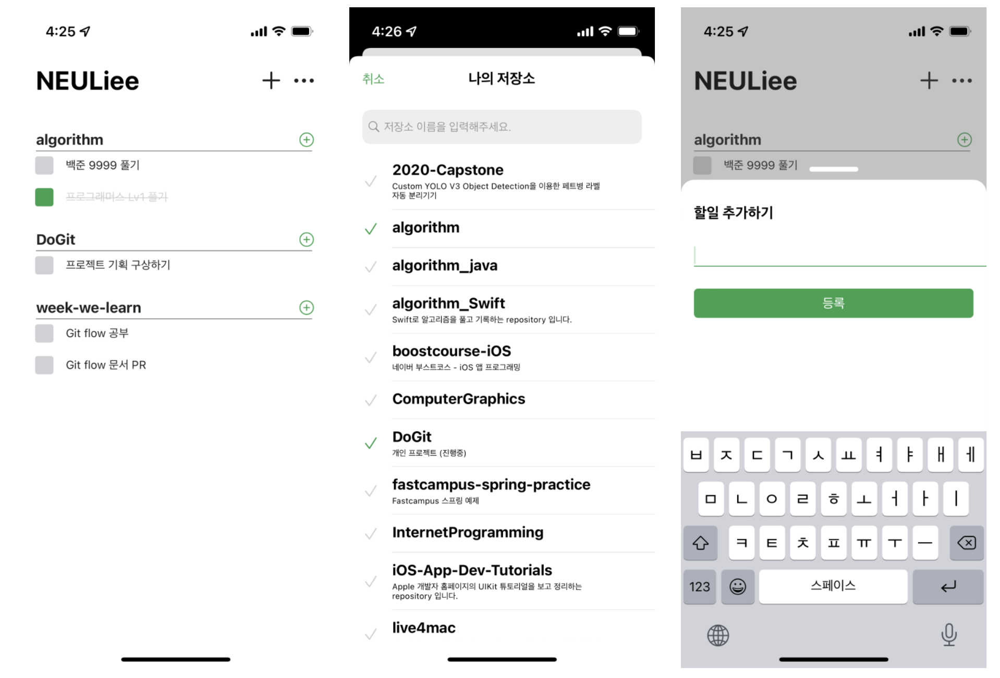

# 두깃 (DoGit)

## Introduction

Github Repository별로 Todo List를 만들 수 있는 App

Github의 여러 Repository에 커밋을 하다보니 issue를 작성하는 것보다 가벼운
Github Repository 만의 Todo를 사용하고 싶어 제작하게 되었습니다.

## Preview

## Supported Platform

- iOS

## Functions

- Github의 이름을 입력하여 저장소를 불러올 수 있습니다.
- 저장소 별로 Todo List를 만들 수 있습니다.
- Todo를 추가, 수정, 삭제할 수 있습니다.

## App Store Download

### 기획
[앱구상](https://neuli.notion.site/1483becafc2846fbb01f80311c31c186)  
[기능 정리](https://neuli.notion.site/e020c2e275e64dd085792a8adfced6ae)
